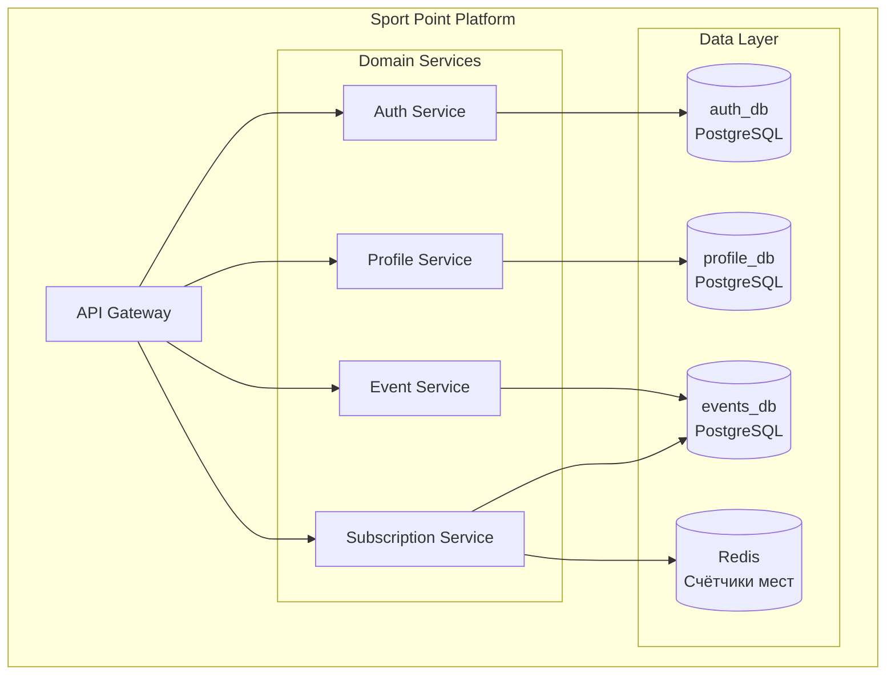
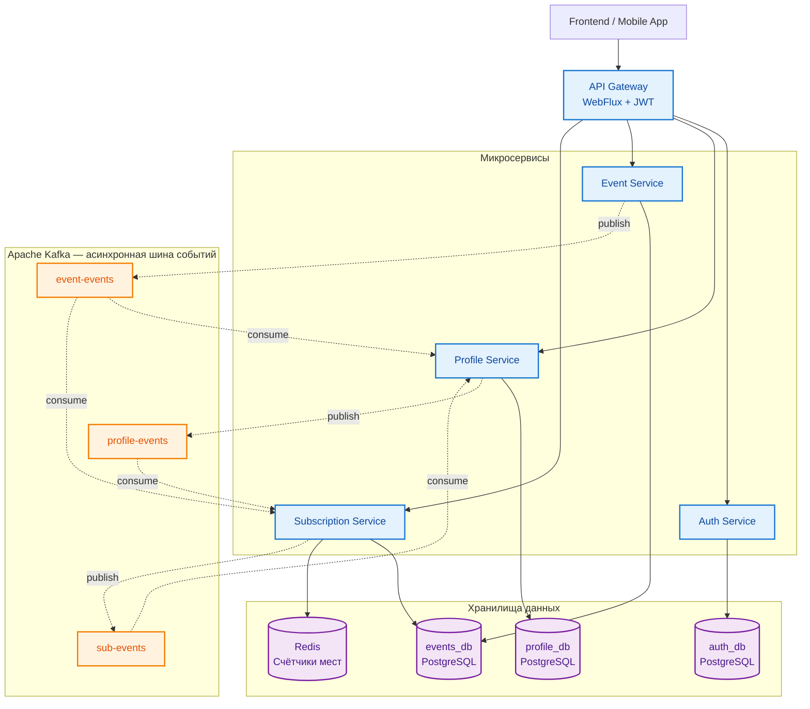
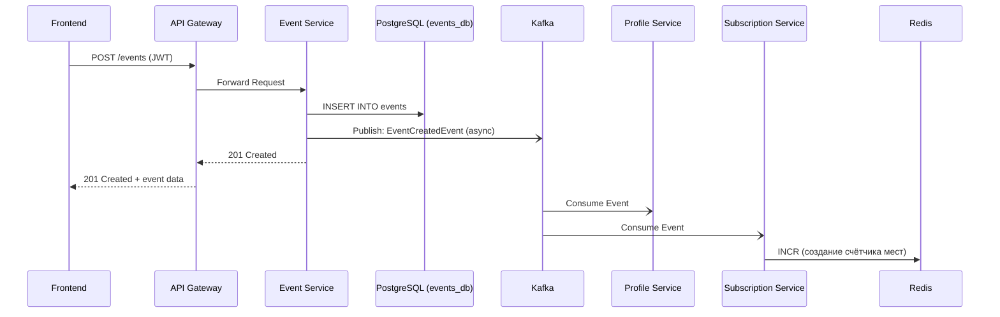
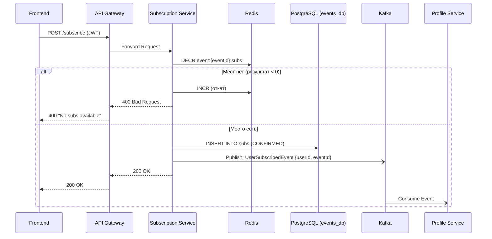
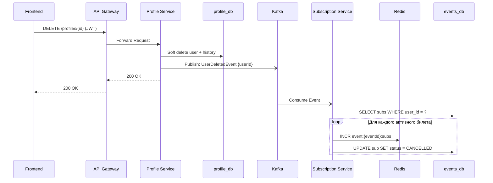
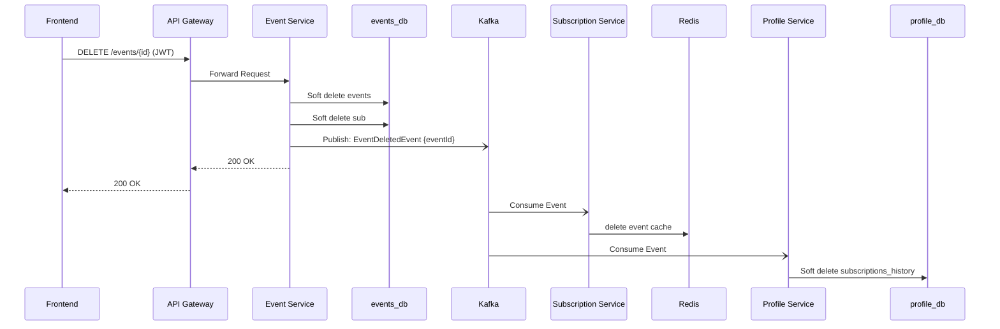

# Sport Point

## Тема проекта
Разработка высоконагруженной **Event-driven микросервисной платформы** для создания, поиска и участия в городских спортивных ивентах с интерактивной картой, системой профилей и асинхронным взаимодействием между сервисами.

## Суть проекта
**Sport Point** — это платформа, которая объединяет активных людей города. Основные возможности:

- **Карта ивентов (афиша)** — пользователи видят все мероприятия на интерактивной карте города
- **Создание ивентов** — любой пользователь может организовать своё событие (пробежка, турнир, тренировка и т.д.)
- **Подписка и участие** — можно записаться на интересующее ивент и увидеть список других участников
- **Профиль пользователя** — каждый может рассказать о себе, своих интересах и спортивной активности
- **История активности** — в профиле отображаются все ивенты, в которых пользователь участвовал
---

## Стек технологий

| Категория | Технологии |
| :--- | :--- |
| **Языки и фреймворки** | Java, Spring Boot, Spring WebFlux |
| **Работа с данными** | Spring Data JPA, Spring Data Redis, Spring Kafka |
| **Базы данных** | PostgreSQL|
| **Кэширование** | Redis |
| **Брокер сообщений** | Apache Kafka|
| **Инфраструктура** | Docker, Docker Compose |
| **Безопасность** | Spring Security, JWT|
| **Логирование** | Slf4j|
| **Архитектурные паттерны** | API Gateway, Event-Driven Architecture, Saga (хореография) |

---

## Структура проекта (Микросервисы и БД)

Проект построен по принципу **Database-per-Service / Domain**. Каждый сервис владеет своей предметной областью и своими данными.

### Детальная таблица сервисов

| Микросервис | Ответственность | База данных | Ключевые эндпоинты |
| :--- | :--- | :--- | :--- |
| **Gateway** | Маршрутизация, балансировка, JWT-валидация, обогащение заголовков | — | Проксирует все запросы |
| **Auth Service** | Регистрация, аутентификация, выпуск JWT, CRUD пользователей | `auth_db` (PostgreSQL) | `/register`, `/login`, `/users/**` |
| **Profile Service** | Публичные профили, история активности, подписки пользователя | `profile_db` (PostgreSQL) | `/profiles/**` |
| **Event Service** | Создание и управление ивентами, метаданные мероприятий | `events_db` (PostgreSQL) | `/events/**` |
| **Subscription Service** | Подписки на ивенты, владение "местами", билетами | `events_db` (PostgreSQL) + **Redis** | `/subscriptions/**` |

---

## Схема базы данных

### `auth_db` (Auth Service)
| Таблица | Поля | Описание |
| :--- | :--- | :--- |
| **`users`** | `id` (PK), `username`, `password_hash`, `role`, `created_at`, `status` | Учётные записи пользователей |

###  `profile_db` (Profile Service)
| Таблица | Поля | Описание |
| :--- | :--- | :--- |
| **`profiles`** | `id` (PK), `user_id` (FK), `bio`, `avatar_url`, `location`, `status` | Публичные профили с информацией о себе |
| **`subscriptions_history`** | `id` (PK), `user_id`, `event_id`, `subscribed_at`, `participant_role` | История активности пользователя (для отображения в профиле) |

### `events_db` (Event Service + Subscription Service)
| Таблица | Поля | Описание |
| :--- | :--- | :--- |
| **`events`** | `id` (PK), `title`, `description`, `date`, `location_lat`, `location_lng`, `organizer_id`, `total_participants`, `status` | Метаданные ивентов с координатами для карты |
| **`subscriptions`** | `id` (PK), `user_id`, `event_id`, `subscribed_at` | Факты подписок на ивенты |

### Redis (только Subscription Service)
| Ключ | Тип | Описание |
| :--- | :--- | :--- |
| `event:{eventId}:subs` | String (Integer) | Атомарный счётчик свободных мест. Операции `DECR` / `INCR` |
---

## Общая схема взаимодействия

### Архитектурный принцип
- Синхронный вход — клиент всегда получает мгновенный ответ от сервиса, которому адресован запрос
- Асинхронный "хвост" — каскадные операции (очистка подписок, возврат мест) выполняются через Kafka
- Атомарность критичных операций — Redis гарантирует корректную работу с местами даже под нагрузкой
- Слабая связанность — сервисы не знают друг о друге, общаются только через события
- Отказоустойчивость — падение одного сервиса не валит всю систему
- Масштабируемость — каждый сервис можно масштабировать независимо
- Быстрый отклик — клиент получает ответ мгновенно, "грязная работа" уходит в фон
- Отсутствие блокировок и "эффекта домино" при падении одного из сервисов

### Бизнес-сценарии

#### Сценарий 1: Создание ивента на карте
REST-запрос обрабатывается синхронно. Счётчик мест в Redis инициализируется через Subscription Service. В профиле создателя отображается новая подпистка с ролью "OWNER".

#### Сценарий 2: Подписка пользователя на ивент
Ключевой сценарий — именно здесь Redis показывает всю свою мощь. Атомарный DECR защищает от овербукинга даже при тысячах одновременных запросов.

#### Сценарий 3: Удаление пользователя (каскадная очистка)
Пользователь удаляет аккаунт → Profile Service чистит свои таблицы → через Kafka Event Service возвращает места в продажу.

#### Сценарий 4: Удаление ивента
Организатор отменяет мероприятие → Event Service чистит свои данные → Profile Service асинхронно удаляет подписки из профилей пользователей.
